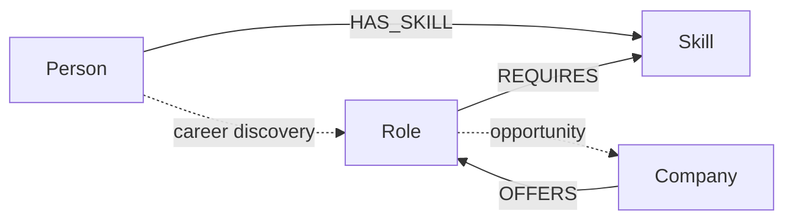

# GraphPath — CognoDB Career Graph Explorer

A small, complete web application built for the WEXA AI CognoDB take-home assignment. GraphPath models career discovery as a graph connecting **People → Skills → Roles → Companies** and uses multi-hop Cypher traversals to recommend relevant roles.

## 1. Use case

A candidate usually does not think in isolated database rows. They think in connections: **what skills do I have, which roles require those skills, and which companies offer those roles?** GraphPath turns those connections into an explorable career graph.

## 2. Why a graph database?

A relational design can store People, Skills, Roles and Companies in separate tables, but relationship-heavy questions quickly become chains of joins. GraphPath uses direct traversals so questions like `Person → Skill → Role → Company` stay close to the way the domain is reasoned about. The model can also grow naturally by adding nodes such as Course, Mentor, Project or Location and attaching new relationships without changing every existing entity.

## 3. Data model



**Nodes**
- `Person(id, name)`
- `Skill(name, category*)`
- `Role(id, title, company_type, description)`
- `Company(name)`

**Relationships**
- `(Person)-[:HAS_SKILL]->(Skill)`
- `(Role)-[:REQUIRES]->(Skill)`
- `(Company)-[:OFFERS]->(Role)`

`category` is optional because the core assignment only requires properties where they are useful.

## 4. Main graph queries

### A. Multi-hop skill-to-role matching

`Person → Skill ← Role` is a two-hop graph traversal from the candidate through shared skills to roles. The query counts matched skills and returns a fit percentage.

### B. Graph-native career path discovery

`Person → Skill ← Role ← Company` returns candidate-to-opportunity paths. This is intentionally relationship-oriented and would be awkward to express and maintain as a sequence of relational joins for every new relationship type.

### C. Parameterisation

All runtime values are passed to the Neo4j driver as parameters, for example `$person_id` and `$role_id`. User strings are never concatenated into Cypher.

## 5. Project structure

```text
cognodb_assignment_2/
├── app/
│   ├── __init__.py
│   ├── config.py
│   ├── db.py
│   ├── queries.py
│   └── routes.py
├── data/
│   └── seed.cypher
├── scripts/
│   └── seed.py
├── static/
│   ├── app.js
│   └── styles.css
├── templates/
│   ├── base.html
│   ├── index.html
│   └── role.html
├── tests/
│   └── test_smoke.py
├── .env.example
├── .gitignore
├── README.md
├── requirements.txt
└── run.py
```

## 6. Run locally

### Step 1 — Create a CognoDB instance

Create a free CognoDB Cloud instance and copy its `bolt+s://...databases.cognodb.cloud` URI and generated `cognodb` password. Keep the password out of Git.

### Step 2 — Install dependencies

```bash
python -m venv .venv
# Windows
.venv\\Scripts\\activate
# macOS / Linux
source .venv/bin/activate
pip install -r requirements.txt
```

### Step 3 — Configure secrets

Copy `.env.example` to `.env` and set:

```env
COGNODB_URI=bolt+s://YOUR_INSTANCE_ID.databases.cognodb.cloud
COGNODB_USER=cognodb
COGNODB_PASSWORD=YOUR_PASSWORD
FLASK_SECRET_KEY=change-me
DEMO_MODE=false
```

### Step 4 — Seed the graph

```bash
python scripts/seed.py
```

### Step 5 — Start the app

```bash
python run.py
```

Open `http://localhost:5000`.

### Demo mode

The repository defaults to `DEMO_MODE=true` so the UI can be inspected without exposing database credentials. Set `DEMO_MODE=false` after configuring CognoDB to use live graph data.

## 7. Error handling and engineering notes

- Database credentials are read from environment variables.
- `db.py` centralises driver creation and connectivity checks.
- The UI shows a database status badge and an explicit error state when CognoDB is unreachable.
- The application has a `/health` endpoint for deployment checks.
- The code separates configuration, database access, queries and HTTP routes.
- The smoke tests validate the demo-mode application shell without requiring a live database.

## 8. Hosted demo and screen recording

For the final submission, deploy this Flask app to a free Python-compatible host, set the CognoDB environment variables there, and keep the CognoDB instance running. Record a 60–90 second walkthrough showing:

1. Home page and candidate skill profile.
2. Search for a role.
3. Open a role detail page.
4. Show the multi-hop path / company relationships.
5. Briefly explain why the graph model is useful.

This repository intentionally does **not** contain secrets, a fake hosted link, or a fake recording. Those final submission assets require the actual CognoDB instance and the candidate's hosting account.

## 9. Submission checklist

- [ ] Push this repository to GitHub.
- [ ] Add the final hosted demo URL to the submission email/README.
- [ ] Attach/share a short screen recording.
- [ ] Keep the CognoDB instance running after submission.
